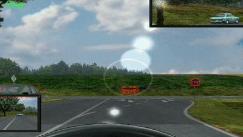

# Traffic Sign Detection and Classification

<p align="center">
  
</p>
<p align="center">
  📄 <a href="Writeup.pdf">Read the full methodology</a>
</p>
<p align="center">
  🎥 <a href="https://drive.google.com/file/d/1HY_Aa3knheXRfJikfdaJPv2RrXeMSeKE/view?usp=sharing">Watch the full demo</a>
</p>

## 📌 Overview
This project implements a **real-time traffic sign detection and classification system** using computer vision and machine learning techniques. It detects and classifies various traffic signs from video streams or images, making it useful for **autonomous vehicles** and **driver assistance systems**.

## ✨ Features
- 🚗 Real-time traffic sign detection  
- 🛑 Multi-class traffic sign classification  
- 🎞️ Support for video streams and image inputs  
- ⚡ High accuracy and fast processing  
- 🖼️ Visualization of detection results  

## 📂 Project Structure
```text
Traffic-Sign-Detection/
├── TrafficSignDetectorAndClassifier.ipynb  # Main implementation notebook
├── Classifier.drawio                       # System architecture diagram
├── Demo.mp4                                # Demo video
└── README.md                               # This file
